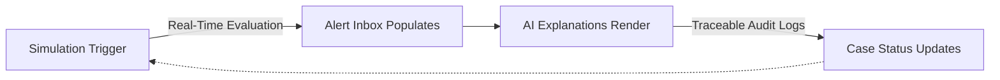

# Data & Simulation Note
## Liquidity Sentinel — Multi-Provider MFS Liquidity & Anomaly Decision Support

Evaluated against two criteria: **Data Rigor & Explainability** (does the simulated environment behave like a real multi-agent MFS system) and **Responsible Architecture** (does the system act safely under uncertainty).

---

## 1. How the Data Is Generated

```
                 ┌────────────────────────────────────────┐
                 │       SYNTHETIC DATA GENERATION         │
                 └────────────────────────────────────────┘
                                      │
                 ┌────────────────────┴────────────────────┐
                 ▼                                          ▼
   ┌───────────────────────────┐              ┌───────────────────────────┐
   │  TIME-WEIGHTED BASELINE   │              │     INJECTED ANOMALIES    │
   │  (95% · Last 24–48 Hours) │              │     (5% · Last 15 Min)    │
   ├───────────────────────────┤              ├───────────────────────────┤
   │ Simulates normal rhythm   │              │ High-velocity clusters    │
   │ Establishes burn rate     │              │ Hidden wallet drains      │
   │ Populates dashboards      │              │ Late / conflicting syncs  │
   └───────────────────────────┘              └───────────────────────────┘
```

| Layer | Detail |
|---|---|
| **Baseline (~95%)** | 24–48h of history across 4 agent profiles (Normal, Busy, Low Cash, Vulnerable). Volume weighted to real market hours — peak 4–9 PM, near-zero 2–6 AM. |
| **Injected anomalies (~5%)** | Sharp transaction clusters placed in the final 15 minutes before "now" — keeps the baseline clean and lets a live-triggered scenario visibly change system state during demo. |

---

## 2. Assumptions

- **Burn-rate continuity** — a rolling 2-hour transaction velocity predicts the next 60 minutes. Simplified, but fully traceable: every projection points back to the exact window and rate that produced it.
- **Shared vs. isolated liquidity** — physical cash is one pool per agent; each provider's e-money balance is isolated and non-fungible. Enforced at the data model level, matching the real constraint that agents can't informally move value between bKash, Nagad, and Rocket.

## 3. Limitations

- **Local shocks not modeled** — connectivity outages, holidays, and other regional events aren't variables in this system.
- **Fixed thresholds, not learned ones** — detection constants are calibrated against simulated scenarios, not historical precision/recall. Production use would require ongoing, human-reviewed recalibration.

---

## 4. Core Detection Scenarios

| Scenario | Challenge | How It's Addressed |
|---|---|---|
| **A. Baseline vs. Anomaly** | An Eid-eve rush is normal; two accounts splitting ৳24,500 into near-identical transactions 5 minutes apart is not. | Detection checks transaction count **and** amount-clustering together — high volume with diverse amounts vs. low volume with tightly clustered amounts produce distinct evidence and confidence levels. |
| **B. Illusion of Aggregate Health** | ৳120K cash + ৳80K Nagad + ৳60K Rocket + ৳8K bKash = ৳268K total — looks healthy, but bKash alone can't serve customers for more than a few minutes. | Every provider balance is evaluated as a **share of total liquidity**, not folded into one number — surfaces exactly this imbalance while the total still looks fine. |
| **C. Data Inconsistency & Latency** | Provider gateways drop logs, arrive late, or conflict. | Every transaction carries late/conflicting flags. When present, confidence downgrades automatically (High → Medium → Low) and the recommendation shifts to manual verification — never a confident automated warning on bad data. |

---

## 5. System Flow



Every action on an alert — acknowledge, escalate, resolve — is written to an immutable audit log, giving a complete, traceable case history from detection to closure.

---

## 6. Demonstration Methodology

1. **Historical foundation** — a seed process pre-populates the dashboard so it opens fully operational: balanced accounts, stable risk indicators, populated trend charts.
2. **Live injection** — scenarios are triggered on stage via the Simulation Cockpit, writing real transaction data and forcing a live re-evaluation — not a pre-recorded outcome.

---

## 7. Responsible Design

- Every alert carries a confidence level and evidence — **never a fraud determination.**
- **No automated action** — no frozen funds, no blocked users, no cross-provider fund movement.
- Every case requires human acknowledgment, ownership, and action; escalation hands a case to a person, never to automation.
- Provider balances stay structurally isolated — the system can never imply unauthorized conversion between bKash, Nagad, and Rocket.
